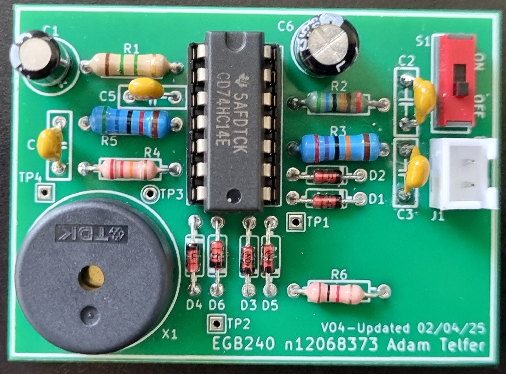

# Electronic Buzzer

This is an electronic buzzer that made for a university design project.  

The buzzer oscillates between a 2 kHz and 5 kHz tone, with the rate of oscilation between the tones changing between 2 Hz and 4 Hz. Refer to the report for details about the design and results.
